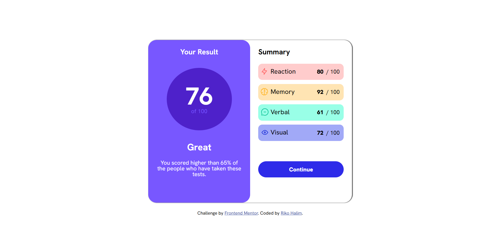

# Frontend Mentor - Results summary component solution

This is a solution to the [Results summary component challenge on Frontend Mentor](https://www.frontendmentor.io/challenges/results-summary-component-CE_K6s0maV). Frontend Mentor challenges help you improve your coding skills by building realistic projects.

### Screenshot

### Link

- Live Site URL: https://result-summary-component-ten-gilt.vercel.app/

### Built with

- HTML5
- CSS3
